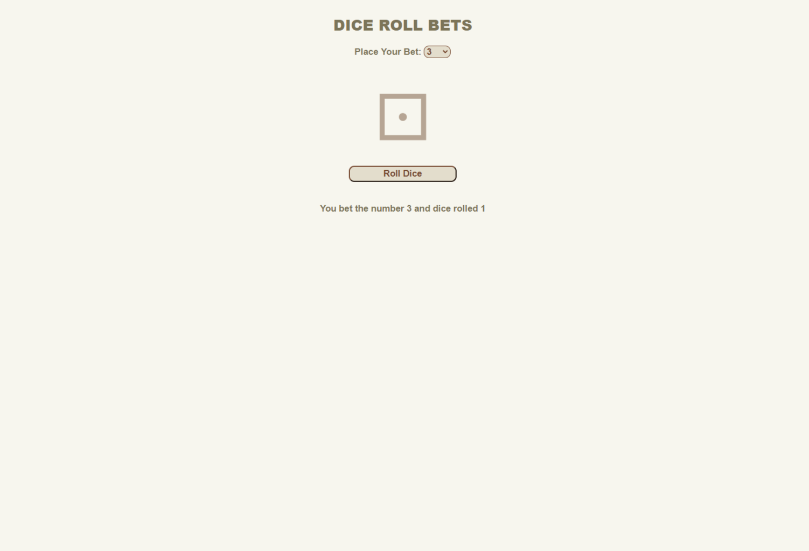

# Dice Roll App

Dice Roll app that was created with HTML/CSS and JavaScript

### Make your bets and roll the dice! [here](https://kimdaby.github.io/Dice-Roll-App/)

## Summary

The dice roll game is a captivating web-based application created with HTML, CSS, and JavaScript. Players bet on a number between 1 and 6, representing possible dice outcomes. JavaScript handles game logic, validating inputs and generating random dice rolls. If the player's bet matches the roll, they win and their balance increases; otherwise, they lose the bet amount. HTML provides the structure, CSS adds visual appeal, and JavaScript ensures seamless functionality. The game dynamically updates the player's balance and delivers informative messages, offering an immersive and exciting gaming experience in a compact and accessible format.

## Author

David (Yun) Kim
